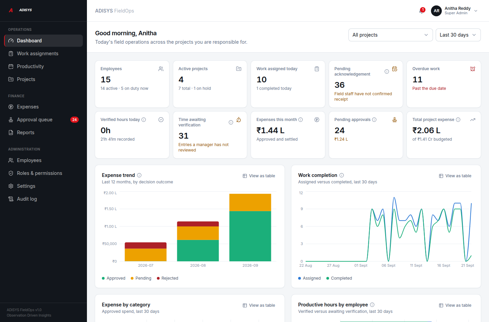
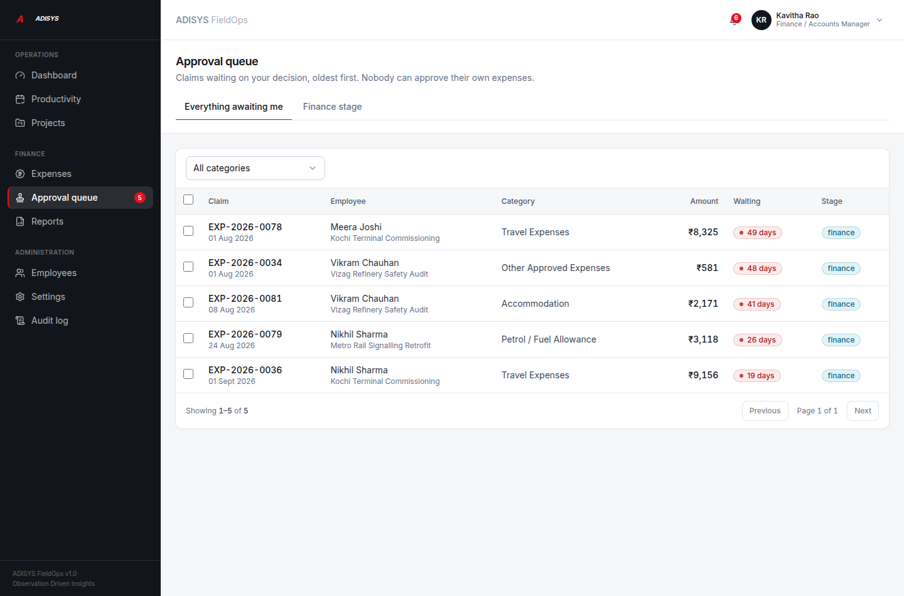
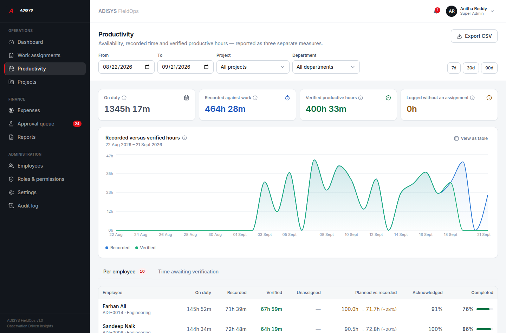
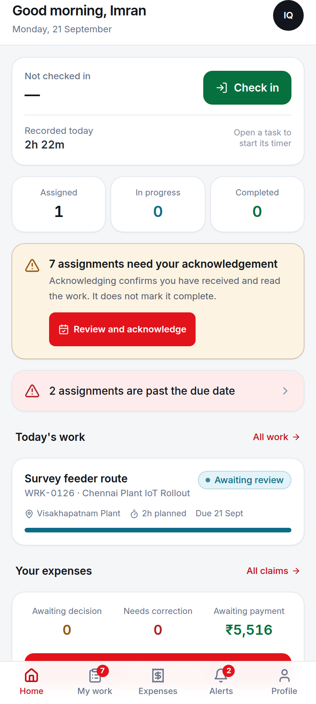
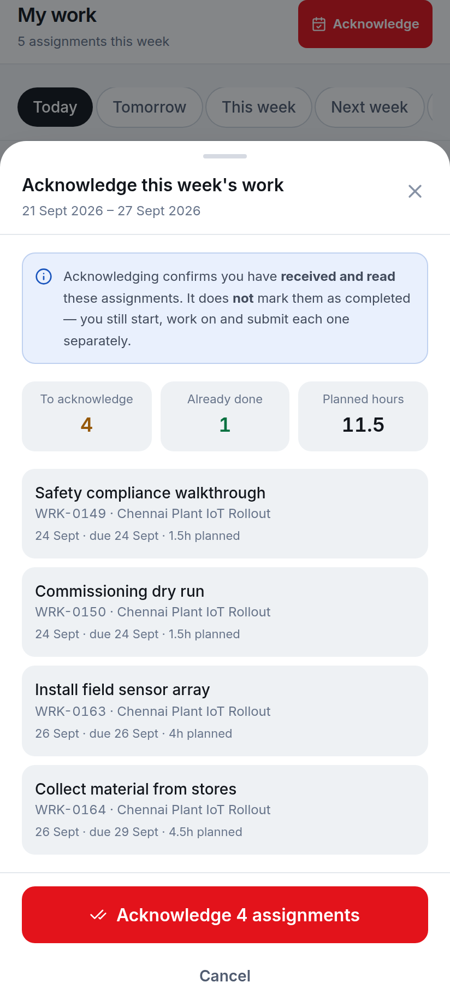
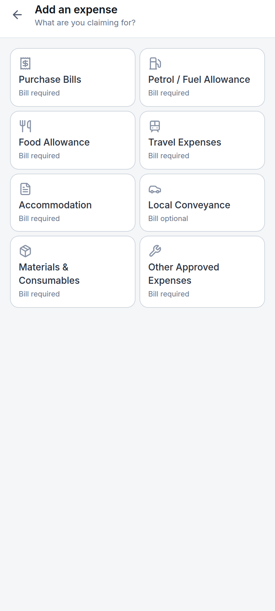

# Screens

Captured from the running application against the seeded demonstration data —
not mockups.

## Admin web portal (1440 × 950)

### Dashboard

KPI row, then charts. Note **Verified hours today: 0h** against **21h 41m
recorded** — today's entries have not been verified yet, so they are correctly
reported as recorded rather than productive.

### Approval queue

Oldest first, with ageing badges, multi-select and bulk decisions. Each claim
is decided independently, so one the approver may not action does not block the
rest.

### Productivity

The three measures side by side — on duty, recorded against work, verified
productive hours — plus time logged without an assignment, reported separately.

## Employee Android app (412 × 915)

### Home

On-duty state with check in/out and the live timer, today's counts, the
acknowledgement prompt, today's work and the expense summary.

### Weekly acknowledgement

The confirmation screen lists exactly what is about to be acknowledged and
states plainly that this is **not** a completion. Nothing is acknowledged until
the employee confirms.

### Submitting a bill

Camera first, then amount, project and the category's own fields. The category
limits are shown inline, and the bar above the action buttons says exactly what
is still missing.
